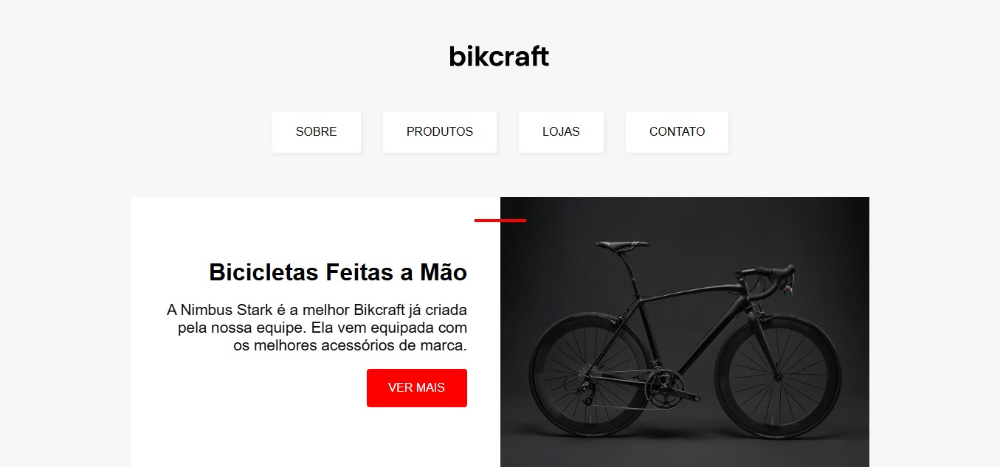

# Bikcraft

## Bem-vindo! 👋
Obrigado por ver meu projeto!

## Descrição do projeto 😀
Esse projeto aborda sobre a Bikcraft, um site de compras de bicicletas, feito com a ajuda da plataforma Origamid.

## Como os usuários podem utilizá-lo?
Neste site, podemos encontrar uma das bicicletas da loja, sendo mostrada.

## Tem algum feedback? 😁
Adoro receber feedbacks! Estou sempre buscando melhorar meus projetos. Então, se você tiver algo que gostaria de mencionar, envie um e-mail para carvalho.godinho2008@gmail.com!

## Tecnologias utilizadas
HTML5 e CSS3

## Contribuidores
Origamid

## Autor do projeto.
Pedro Godinho

**Compartilhe este repositório!** 🚀